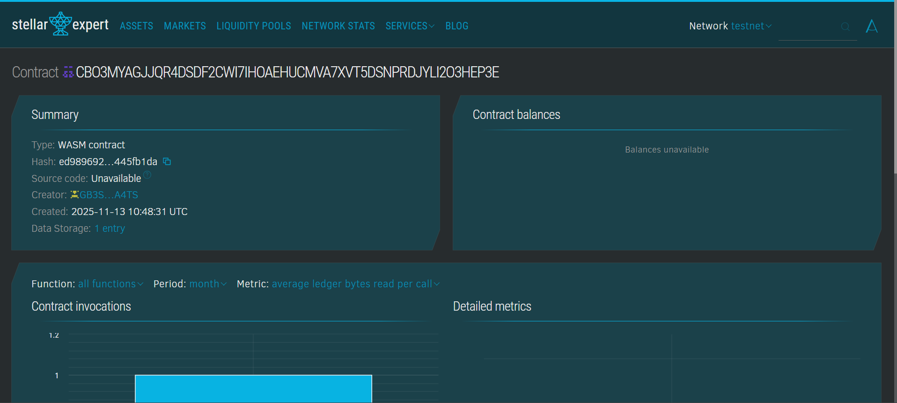

# Voting System

## Project Title
**Decentralized Voting System on Stellar**

## Project Description
A transparent and immutable voting platform built on the Stellar blockchain using Soroban smart contracts. This system enables DAOs (Decentralized Autonomous Organizations) and communities to conduct secure, transparent voting processes where each vote is recorded on-chain, ensuring complete auditability and preventing vote manipulation.

The smart contract allows community members to:
- Create voting proposals with detailed descriptions
- Cast votes (YES or NO) on active proposals
- Track voting statistics in real-time
- Close proposals once voting periods end

All voting data is stored on the Stellar blockchain, making it permanently accessible and verifiable by anyone.

## Project Vision
Our vision is to revolutionize democratic decision-making in decentralized communities by providing a trustless, transparent voting infrastructure. We aim to:

- **Eliminate Vote Manipulation**: Blockchain-based voting ensures every vote is recorded immutably
- **Increase Participation**: Lower barriers to participation in community governance
- **Build Trust**: Complete transparency allows any community member to verify voting results
- **Empower Communities**: Give DAOs and communities the tools to make collective decisions efficiently
- **Scale Democratic Processes**: Enable thousands of communities to conduct fair, secure votes simultaneously

By leveraging Stellar's fast and cost-effective blockchain infrastructure, we're making decentralized governance accessible to communities of all sizes.

## Key Features

### 1. **Proposal Creation**
- Community members can create voting proposals with titles and descriptions
- Each proposal receives a unique ID for tracking
- Automatic timestamping of proposal creation
- Real-time statistics tracking

### 2. **Secure Voting Mechanism**
- One-vote-per-address enforcement to prevent double voting
- Simple YES/NO voting system for clarity
- Address authentication to verify voter identity
- Immutable vote recording on blockchain

### 3. **Transparent Vote Counting**
- Real-time vote tallies (YES and NO counts)
- Public accessibility of all voting data
- Complete audit trail of all votes
- No possibility of vote manipulation after casting

### 4. **Proposal Management**
- Admin capability to close proposals
- Active/Closed status tracking
- Comprehensive voting statistics (total, active, closed proposals)
- Extended TTL for long-term data persistence

### 5. **Blockchain Benefits**
- Immutable voting records
- Complete transparency
- No central authority required
- Low transaction costs on Stellar
- Fast confirmation times

## Future Scope

### Short-term Enhancements
1. **Weighted Voting**: Implement token-based voting where vote weight corresponds to token holdings
2. **Time-locked Proposals**: Add automatic proposal closure after a specified duration
3. **Quorum Requirements**: Set minimum participation thresholds for proposal validity
4. **Multiple Choice Voting**: Expand beyond YES/NO to support multiple options

### Medium-term Development
1. **Delegation System**: Allow voters to delegate their voting power to trusted representatives
2. **Voting Power Snapshots**: Capture token balances at proposal creation to prevent vote buying
3. **Proposal Categories**: Organize proposals by type (governance, funding, technical, etc.)
4. **Voting Analytics Dashboard**: Provide detailed insights into voting patterns and trends
5. **Multi-signature Proposals**: Require multiple admins to approve proposal creation or closure

### Long-term Vision
1. **Cross-chain Voting**: Enable voting across multiple blockchain networks
2. **Anonymous Voting**: Implement zero-knowledge proofs for private ballot casting while maintaining verifiability
3. **AI-powered Proposal Analysis**: Automatically summarize and categorize proposals
4. **Liquid Democracy**: Hybrid system allowing direct voting or delegation on a per-proposal basis
5. **Incentivized Participation**: Reward active voters with governance tokens
6. **Integration with Popular DAOs**: Native integration with existing DAO platforms (Aragon, DAOstack, etc.)
7. **Mobile dApp**: Native mobile applications for iOS and Android
8. **Reputation System**: Track voting history and reward consistent, thoughtful participation

### Technical Roadmap
- **Gas Optimization**: Further reduce transaction costs
- **Advanced Security Audits**: Regular third-party security assessments
- **Scalability Improvements**: Handle thousands of concurrent proposals
- **API Development**: RESTful API for easy integration with external applications
- **SDK Creation**: Developer tools for building voting-enabled dApps

---

## Getting Started

### Prerequisites
- Soroban SDK installed
- Stellar network access
- Basic understanding of Rust and smart contracts

### Deployment
```bash
# Build the contract
soroban contract build

# Deploy to network
soroban contract deploy \
    --wasm target/wasm32-unknown-unknown/release/voting_contract.wasm \
    --network testnet
```

### Usage Example
```bash
# Create a proposal
soroban contract invoke \
    --id <CONTRACT_ID> \
    --network testnet \
    -- create_proposal \
    --title "Fund Marketing Campaign" \
    --description "Allocate 10,000 XLM for Q1 marketing"

# Cast a vote
soroban contract invoke \
    --id <CONTRACT_ID> \
    --network testnet \
    -- cast_vote \
    --proposal_id 1 \
    --vote_yes true \
    --voter <YOUR_ADDRESS>

# View proposal
soroban contract invoke \
    --id <CONTRACT_ID> \
    --network testnet \
    -- get_proposal \
    --proposal_id 1
```

---

## Contributing
We welcome contributions from the community! Please submit pull requests or open issues on our repository.

## License
This project is licensed under the MIT License.

## Contact
For questions or support, please reach out to our development team.

## contract details

Contract ID - CBO3MYAGJJQR4DSDF2CWI7IHOAEHUCMVA7XVT5DSNPRDJYLI2O3HEP3E

---

**Built with ❤️ on Stellar Blockchain**